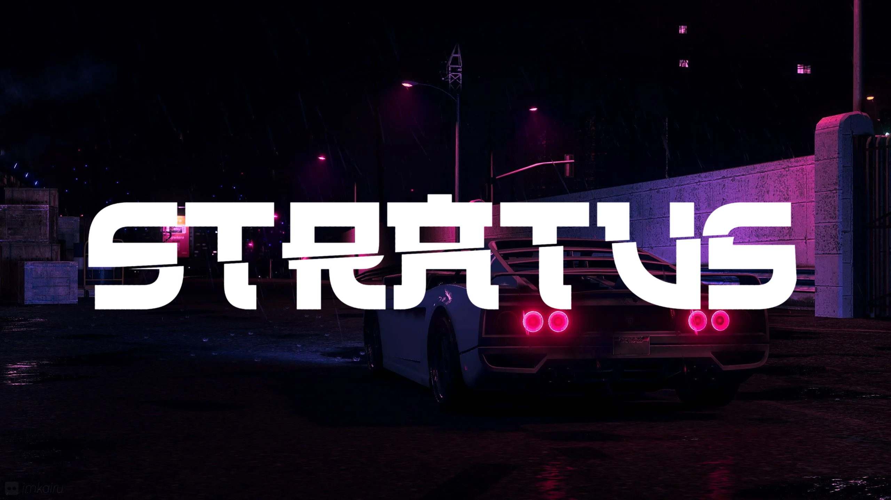

<h1 align="center">
   
  
   
</h1>

<h4 align="center">Cause I dislike already existing boilerplate.</h4>

## Why? ik right?

Wasting so much time to setup a project over, over and over never been more painful for me. So I build `Stratus` where I maintain system components and base project to be used in future projects to help me get started fast in the interesting parts.

<h1 align="center">
   
    
   
</h1>

## Project Structure

Currently there is a single solution, project to help me maintain the project at ease until it good to go it was built to be easy to decouple.
